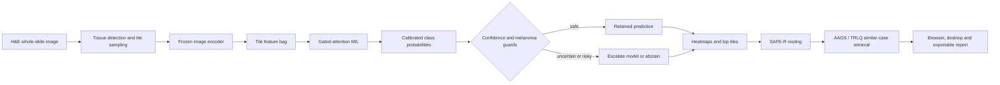

# SkinSight

SkinSight is a melanoma-sensitive whole-slide image (WSI) decision-support
prototype for four-class dermatopathology:

- Normal/Benign
- Basal Cell Carcinoma (BCC)
- Squamous Cell Carcinoma (SCC)
- Melanoma

The system is more than a slide classifier. It combines frozen pathology
encoders, gated-attention multiple-instance learning (MIL), calibrated
probabilities, cost-aware model escalation, selective abstention,
explainability heatmaps and pathology-aware case retrieval.

> Research prototype only. SkinSight is not a medical device and its outputs
> must not be used as an independent clinical diagnosis.

## Final Deliverables

- [Final report](deliverables/SkinSight_Final_Report.pdf)
- [A1 poster](deliverables/SkinSight_A1_Poster.pdf)

Only the final PDFs are versioned. LaTeX, PowerPoint, poster-generation files,
preview images and presentation notes are intentionally excluded.

## System Overview



### 1. WSI and Tile Processing

A pathology specimen is fixed, embedded, cut into a thin section, stained
with hematoxylin and eosin (H&E), mounted on a glass slide and scanned into a
multi-resolution WSI. Hematoxylin mainly highlights nuclei in blue/purple;
eosin highlights cytoplasm and extracellular tissue in pink.

WSIs are too large to pass through a neural network as one image. SkinSight:

1. Reads `.svs`, `.tif` and other OpenSlide-compatible formats.
2. Builds a low-resolution tissue mask.
3. Selects tissue-containing coordinates.
4. Reads a bounded number of image tiles.
5. Resizes each tile to the encoder's expected input resolution.

The runtime uses a configurable tile budget and currently reads 256 x 256
tiles before encoder preprocessing. Some training caches were produced from
512 x 512 source patches. Patch extraction size and encoder input size are
therefore separate concepts; most encoders receive 224 x 224 tensors.

### 2. Frozen Feature Encoders

Each tile is converted into a feature vector by a frozen encoder. The
experiments cover generic and pathology-oriented backbones:

- ResNet18 and ResNet50
- ConvNeXt-Small and ConvNeXt-Base
- DINOv2-base
- Phikon
- UNI
- CONCH

Keeping the encoder frozen makes slide-level experiments cheaper and allows
the same cached feature bags to be reused across MIL losses, ensembles and
safety studies.

### 3. Gated-Attention MIL

A slide is represented as a bag of tile vectors:

```text
slide bag X = {x1, x2, ..., xn}
tile features H = encoder_projection(X)
```

Only the slide diagnosis is required during training; tile-level tumor labels
are not required. For every hidden tile vector `h_i`, the attention module
computes:

```text
a_i = W [tanh(V h_i) * sigmoid(U h_i)]
alpha = softmax(a across all tiles)
z = sum_i alpha_i h_i
```

The `tanh` and `sigmoid` branches form the gate. The first softmax normalizes
importance across tiles, so `alpha_i` expresses how strongly tile `i`
contributes to the slide representation `z`.

The classifier maps `z` to four logits. A second softmax converts those logits
into Normal/Benign, BCC, SCC and Melanoma probabilities. In short:

- attention softmax answers "which tiles matter?"
- class softmax answers "which diagnosis is most probable?"

### 4. Training Objective

The project evaluates cross-entropy, focal loss, melanoma class weighting and
cost-sensitive losses. The selected single-model operating point uses a
stronger penalty for melanoma false negatives. This is an asymmetric safety
choice: missing melanoma is treated as more costly than referring an
uncertain non-melanoma case for review.

The model is still a four-class classifier. The cost matrix changes the
training pressure; it does not add a fifth "review" class.

### 5. Calibration and Gated Inference

Temperature scaling is applied to validation predictions before safety rules
consume the probability vector. Calibration improves the interpretation of
confidence without changing the underlying class ordering.

The default gated application order is:

```text
UNI -> Phikon -> CONCH
```

After each model, probabilities from the models run so far are averaged. The
system stops early when all guard conditions pass. It escalates to the next
encoder when:

- top-class confidence is below `0.70`;
- the top-1/top-2 probability margin is below `0.20`; or
- the prediction is non-melanoma while `P(Melanoma) >= 0.20`.

This "gated app" policy is a compute policy and is different from the gate
inside gated-attention MIL.

### 6. Selective Abstention and Safety

SkinSight does not force every case into an automatic diagnosis. It evaluates:

- calibrated confidence;
- top-1/top-2 margin;
- normalized predictive entropy;
- melanoma probability;
- ensemble disagreement;
- out-of-distribution (OOD) evidence.

The melanoma-first guard is active when the raw prediction is non-melanoma
but melanoma probability remains clinically relevant. If that evidence is
combined with weak confidence, high uncertainty, a narrow margin or ensemble
disagreement, the displayed decision becomes `Needs Expert Review`.

Abstention is therefore a designed triage state, not an additional pathology
class and not automatically a model failure.

### 7. Explainability

The application produces:

- single-model attention;
- ensemble consensus;
- ensemble disagreement;
- shared focus, defined as consensus weighted by low disagreement;
- Melanoma-vs-SCC class-contrastive attention;
- Melanoma-vs-BCC class-contrastive attention;
- ranked high-attention tiles.

Class-contrastive attention compares tile-level class evidence, for example:

```text
contrast_i = score_i(Melanoma) - score_i(SCC)
```

It highlights regions that support melanoma relative to a differential
diagnosis. It is an inference-time explanatory view, not a contrastive
training loss.

### 8. SAFE-R, AAGS and TRLQ Retrieval

The retrieval subsystem searches a curated reference bank for similar cases.
It is risk-aware rather than a plain exhaustive cosine search.

**SAFE-R** assigns a low, moderate or high risk tier from the predicted class,
melanoma probability, confidence, margin and hard-case signals. The tier
determines the candidate pool and search budget.

**AAGS** combines pathology evidence similarities using a weighted geometric
product:

```text
AAGS(q, r) = product_i s_i(q, r) ^ w_i
```

**TRLQ** maps the same similarities to penalties and accumulates them:

```text
cost(q, r) = sum_i w_i * -log(s_i(q, r))
TRLQ score = exp(-cost)
```

The quotient variants use embedding similarity, a model-induced diagnostic
quotient, probability/clinical profile, pathology axis, top-tile evidence,
melanoma contrast, risk lattice and label evidence. A clinically important
mismatch therefore cannot be hidden easily by one high cosine similarity.
The active application method is `trlq_quotient_v2`.

## Evaluation Summary

The frozen internal test bank contains 318 slides:

| Class | Slides |
| --- | ---: |
| Normal/Benign | 79 |
| BCC | 75 |
| SCC | 71 |
| Melanoma | 93 |

Representative internal results:

| Operating point | Evaluated coverage | Macro F1 | Melanoma recall | Melanoma FN |
| --- | ---: | ---: | ---: | ---: |
| UNI cost-sensitive strong | 1.0000 | 0.9541 | 0.9892 | 1 |
| Fixed UNI + Phikon ensemble | 1.0000 | 0.9673 | 1.0000 | 0 |
| Fixed three-model ensemble | 1.0000 | 0.9639 | 0.9892 | 1 |
| Safety abstain, retained cases | 0.6572 | 0.9859 | 1.0000 | 0 |
| Gated application policy | 1.0000 | 0.9603 | 1.0000 | 0 |

These rows answer different questions:

- the fixed ensemble measures classification when all selected models run;
- the gated application measures classification while conditionally skipping
  extra encoders;
- safety-abstain F1 is calculated only on retained cases, so its `0.9859`
  value must not be compared as if it covered all 318 slides.

The gated policy used about 1.02 models per slide in the feature-cost profile.
At the 100-tile operating point, its proxy cost ratio was `0.1766` relative
to a full three-model, 200-tile baseline.

All values are retrospective internal results. The single SOPHIE melanoma
slide was a file-format and pipeline smoke test, not external clinical
validation.

## Repository Layout

```text
.
|-- app/               Flask backend, inference, safety, retrieval and UI
|-- app_desktop/       Windows desktop shell using WebView2
|-- scripts/           Final MIL training and evaluation pipeline
|-- tests/             Lightweight safety, retrieval and route tests
|-- deliverables/      Final report and A1 poster only
|-- requirements.txt  Portable research dependencies
`-- README.md
```

The repository has no internal `data/` directory. Datasets, model weights and
feature caches live outside the repository. Runtime uploads and experiment
results are ignored by Git.

## Setup

The primary development environment is Ubuntu 22.04 under WSL with Python
3.10 and an optional CUDA GPU.

Install the native OpenSlide library using the package manager for your
operating system, then create the Python environment:

```bash
python3 -m venv .venv
source .venv/bin/activate
python -m pip install --upgrade pip
python -m pip install -r requirements.txt
```

For application-only installation:

```bash
python -m pip install -r app/requirements.txt
```

Foundation-model weights and experiment checkpoints are not committed.
The current research configuration expects the following default layout:

```text
/mnt/d/skin_cancer_project/
|-- datasets/
|-- models/
|   |-- pathology/phikon/
|   |-- pathology/uni/pytorch_model.bin
|   `-- pathology/conch/pytorch_model.bin
`-- cache/
```

MIL checkpoints and generated registries are read from the repository-local
`results/` directory. The defaults can be overridden without editing code:

```bash
export SKINSIGHT_DATA_ROOT=/path/to/datasets
export SKINSIGHT_MODELS_ROOT=/path/to/models
export SKINSIGHT_CACHE_ROOT=/path/to/cache
export SKINSIGHT_RESULTS_ROOT=/path/to/results
```

The application and retained pipeline scripts consume these variables.

## Run the Flask Application

```bash
source .venv/bin/activate
python app/server.py
```

Open `http://localhost:5000`. A different port can be selected with:

```bash
PORT=5050 python app/server.py
```

The server exposes upload, asynchronous status, DZI viewing, heatmaps,
similar-case retrieval, history and JSON/PDF export endpoints.

## Run the Windows Desktop Application

The desktop shell starts the Python backend in WSL by default:

```powershell
powershell -ExecutionPolicy Bypass -File app_desktop\launch_desktop.ps1
```

It requires .NET 9, WebView2 and the included OpenSlide Windows runtime.
Environment variables in the launcher can be adjusted when the WSL
distribution, project path or Python environment differs.

## Training and Reproduction

The main four-class training entry point is:

```bash
python scripts/train_all_models_v3.py \
  --models UNI Phikon CONCH \
  --experiments cost_sensitive_strong
```

Useful final-pipeline scripts:

| Stage | Entry point |
| --- | --- |
| Encoder definitions | `scripts/backbone_registry.py` |
| Four-class MIL training | `scripts/train_all_models_v3.py` |
| Canonical registry and split audit | `scripts/build_phase0_registry.py` |
| Hard-case bank | `scripts/build_phase1_hard_case_bank.py` |
| Calibration and OOD safety | `scripts/build_phase2_safety_artifacts.py` |
| Explainability case study | `scripts/build_phase3_case_study_report.py` |
| Retrieval bank | `scripts/build_phase4_retrieval_bank.py` |
| Attention covariance bank | `scripts/build_attention_covariance_bank.py` |
| SAFE-R/AAGS/TRLQ evaluation | `scripts/evaluate_safe_r_retrieval.py` |
| Ensemble and abstention evaluation | `scripts/build_phase6_evaluation.py` |
| Feature-cost profiles | `scripts/evaluate_feature_cost_profiles.py` |
| Real-WSI gated cost benchmark | `scripts/benchmark_gated_feature_cost.py` |
| Tile-budget ablation | `scripts/evaluate_cached_tile_budget_ablation.py` |
| Statistical robustness | `scripts/statistical_robustness_report.py` |
| OOD post-hoc baselines | `scripts/evaluate_ood_posthoc_baselines.py` |
| Decision-curve analysis | `scripts/decision_curve_analysis.py` |

The scripts are artifact-oriented and expect previously generated feature
caches or prediction banks. Run them from the repository root so relative
imports and output paths resolve consistently.

## Tests

The lightweight suite does not require WSI files, GPU inference or model
weights:

```bash
python -m unittest \
  tests.test_similarity_metrics \
  tests.test_phase1_safety \
  tests.test_app_routes_smoke
```

To run every test:

```bash
python -m unittest discover -s tests
```

GitHub Actions also performs a syntax check and the lightweight unit tests.

## Reproducibility and Academic Use

- Split and experiment registries are generated by scripts rather than
  embedding private local paths in the repository.
- Randomized statistical analyses use fixed seeds.
- Metrics from different prediction sources or coverage levels are reported
  separately.
- Model weights, datasets and derived patient material are excluded from Git.
- The final report contains the complete bibliography, methodological
  discussion, limitations and provenance of the reported numbers.

## Limitations

- Evaluation is retrospective and internal.
- OOD performance is preliminary and not sufficient for deployment.
- Selective prediction improves retained-case safety by reducing coverage.
- Attention is supportive evidence, not proof of causal pathology reasoning.
- Similar-case retrieval depends on the quality and labeling of its reference
  bank.
- Prospective, multi-center and pathologist-led validation is required before
  any clinical use.
